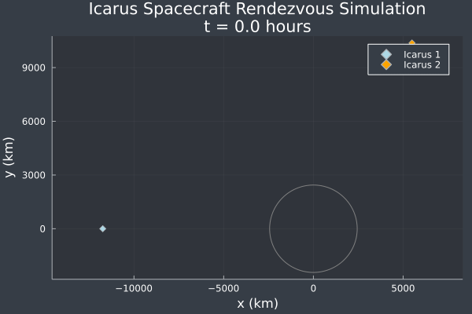

# Scripts

This repo is a collection of various scripts, mainly related to my schoolwork in my aerospace engineering undergraduate program. These were written for personal use/education/reference, I cannot guarantee these will work as intended. 

Documentation on usage can be found on my website: [Personal Scripts Documentation](https://michaszj.github.io/#docs).

Current scripts:
- Aerodynamics
  - `aerodynamics.py`
- Gas Dynamics
  - `flow_table.py`
  - `shock_fitting.py`
- Numerical Methods
  - `find_roots.py`
  - `solve_ode_ivp.py`, `solve_ode_ivp.jl`
  - `optimization.jl`
- Orbital Dynamics
  - `orbital_dynamics.py`, `orbital_dynamics.jl`
  - `orbital_elements.py`, `orbital_elements.jl`
  - `gnc.jl`
- Utilities
  - `animations.py`

Some example scripts are included in `showcase`.

WIP:
- Guidance, navigation, and control
- Control systems
- Trajectory optimization
- Expanding numerical methods
  - Improving `rk_45` to automatically determine required tolerance for a given number of steps
  - More root-finding algorithms
  - Optimization algorithms
  - Integration algorithms
  - Differentiation algorithms
- Expanding orbital dynamics
  - More n-body problem propagators
- Converting more `Python` scripts to `Julia`

# Showcase
## Orbital Dynamics - N-Body Problem
The various orbital dynamics scripts that solve the two-body, circular restricted three-body, and general three-body all use the `rk_45` ODE solver (see [solve_ode_ivp.py](https://github.com/MichaszJ/scripts/blob/main/Numerical-Methods/solve_ode_ivp.py)). 

Two-body problem solution using `two_body_propagator` function:

Three-body problem solution using `three_body_propagator` function:

Lunar transfer and circularization simulation, made using a modified version of the `three_body_cr_propagator` (see [lunar_transfer_sim.py](https://github.com/MichaszJ/scripts/blob/main/Showcase/lunar_transfer_sim.py)), which included thrust terms to simulate the spacecraft firing its engines:

Rendezvous simulation between two spacecraft using `two_body_propagator`, using the `Julia` implementation of the code (and animated with `Plots.jl`):
